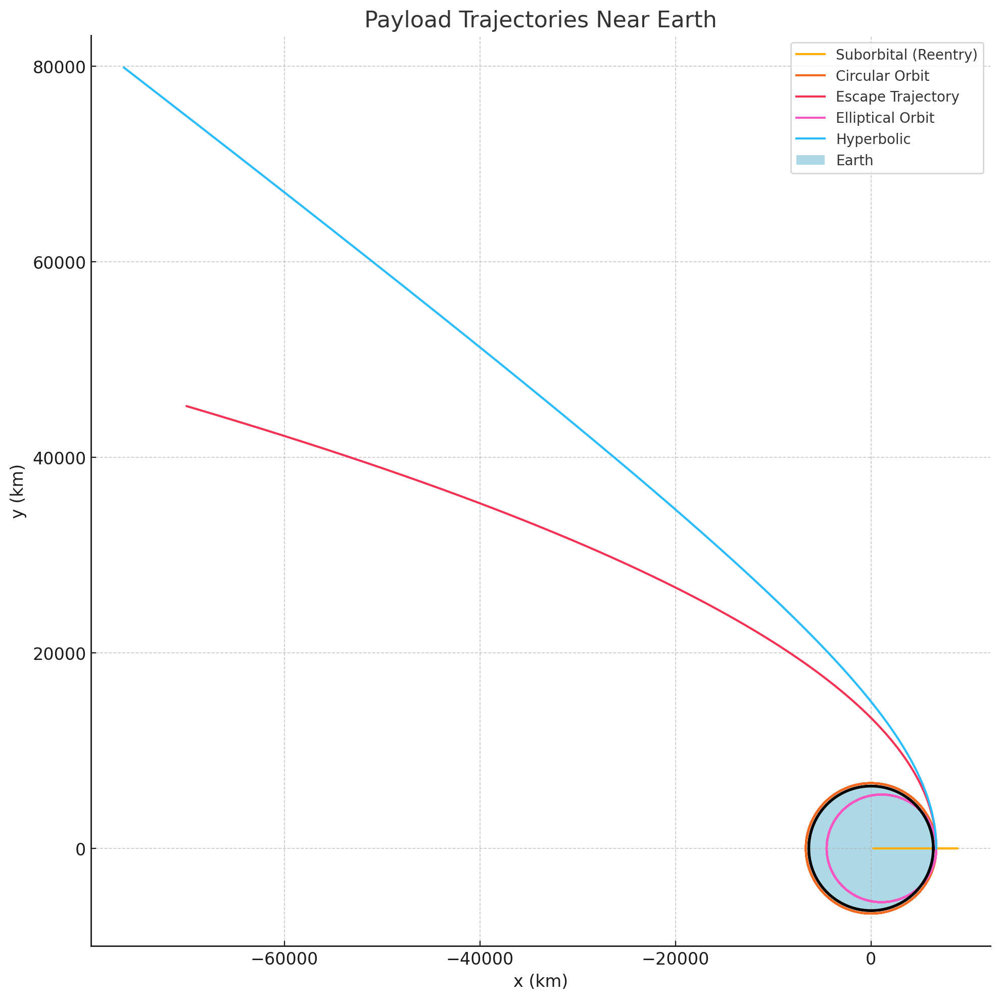

# 🚀 Problem 3: Trajectories of a Freely Released Payload Near Earth

## 🎯 Motivation

When an object is released from a moving rocket near Earth, its trajectory depends on initial conditions and gravitational forces. This is essential for understanding reentry, orbital insertion, or escape during space missions.

## 📚 Theoretical Background

We analyze the motion using Newton's Law of Gravitation:

**F = GMm / r²**

And the resulting acceleration in 2D space:

**aₓ = -GMx / r³**
**aᵤ = -GMy / r³**

Possible trajectory types based on initial velocity:

* **Suborbital (Reentry):** Falls back to Earth.
* **Elliptical Orbit:** Closed orbital path.
* **Circular Orbit:** Special case of elliptical with constant radius.
* **Escape Trajectory:** Exits Earth's gravity.
* **Hyperbolic Path:** Faster-than-escape trajectory.

## 🧽 Python Simulation Code

```python
import numpy as np
import matplotlib.pyplot as plt
from scipy.integrate import solve_ivp

# Constants
G = 6.67430e-11
M = 5.972e24
R_earth = 6.371e6
mu = G * M

def equations(t, y):
    x, vx, y_pos, vy = y
    r = np.sqrt(x**2 + y_pos**2)
    ax = -mu * x / r**3
    ay = -mu * y_pos / r**3
    return [vx, ax, vy, ay]

def simulate_trajectory(r0, v0, t_max=20000, dt=10):
    y0 = [r0[0], v0[0], r0[1], v0[1]]
    t_span = (0, t_max)
    t_eval = np.arange(0, t_max, dt)
    sol = solve_ivp(equations, t_span, y0, t_eval=t_eval, rtol=1e-8)
    return sol

# Initial position (300 km altitude)
altitude = 300e3
r0 = [R_earth + altitude, 0]

# Orbital speeds
v_circular = np.sqrt(mu / np.linalg.norm(r0))
v_escape = np.sqrt(2) * v_circular

# Different scenarios
velocities = {
    "Suborbital (Reentry)": [0.7 * v_circular, 0],
    "Circular Orbit": [0, v_circular],
    "Escape Trajectory": [0, v_escape],
    "Elliptical Orbit": [0, 0.9 * v_circular],
    "Hyperbolic Path": [0, 1.5 * v_circular]
}

# Plot
plt.figure(figsize=(10, 10))

for label, v0 in velocities.items():
    sol = simulate_trajectory(r0, v0)
    x, y = sol.y[0], sol.y[2]
    plt.plot(x / 1000, y / 1000, label=label)

# Draw Earth
theta = np.linspace(0, 2 * np.pi, 1000)
earth_x = R_earth * np.cos(theta) / 1000
earth_y = R_earth * np.sin(theta) / 1000
plt.plot(earth_x, earth_y, 'k', linewidth=2)
plt.fill(earth_x, earth_y, 'lightblue', label="Earth")

plt.xlabel("x (km)")
plt.ylabel("y (km)")
plt.title("Payload Trajectories Near Earth")
plt.axis("equal")
plt.grid(True)
plt.legend()
plt.tight_layout()
plt.savefig("trajectory.png")
plt.show()
```

## 🗃️ Resulting Trajectories

This plot shows the payload’s paths depending on initial velocity:




## 📊 Interpretation

* **Reentry:** Insufficient speed → object crashes to Earth.
* **Circular Orbit:** Maintains constant altitude.
* **Elliptical Orbit:** Varies in distance from Earth.
* **Escape:** Leaves Earth’s gravity with minimum energy.
* **Hyperbolic:** Exceeds escape velocity with faster trajectory.

## 🚀 Applications

* Satellite deployment
* Capsule reentry simulations
* Interplanetary mission design
* Space debris risk analysis

---

📅 **To view the plot:**

* Save the Python code in a file like `simulate.py` and run it.
* Ensure `trajectory.png` is generated and placed next to `README.md`.
* Push your project to GitHub — the image and layout will display properly.
